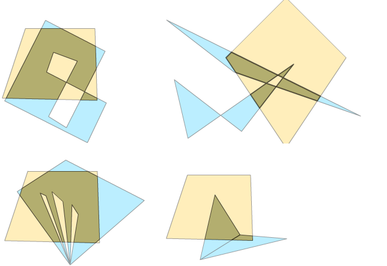

# Polygon Clipper #

This library implements scanline
[Bala Vatti clipping algorithm](https://en.wikipedia.org/wiki/Vatti_clipping_algorithm)
in Haxe.
It allows you to combine, subtract, intersect and perform Xor operation on arbitrarily shaped polygons
simultaneously with the high efficiency.

